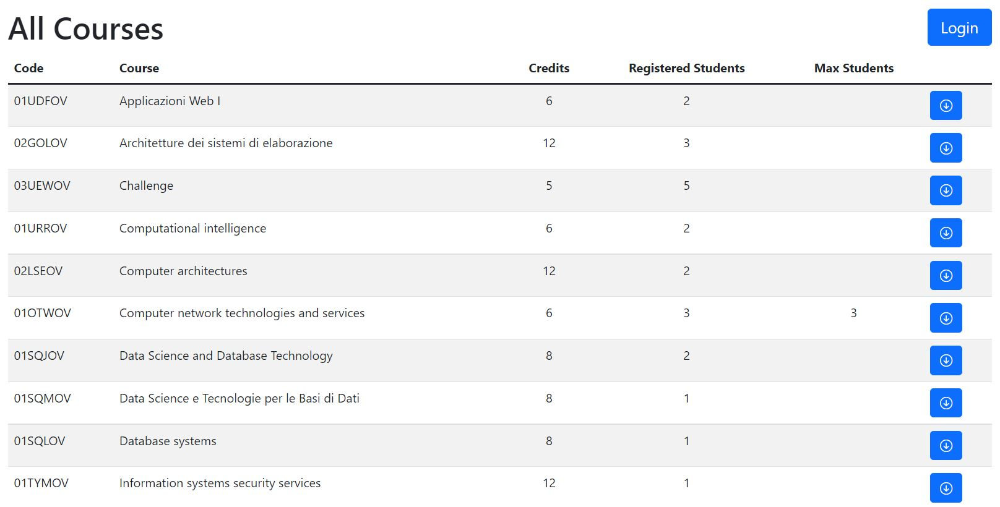
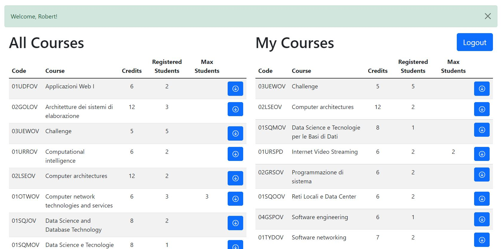
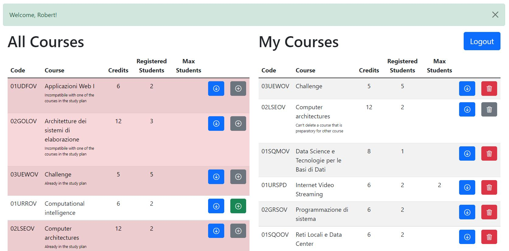

# StudyPlan

StudyPlan project for WebApp course.

## Setup

1. Install packages using `npm install` in both `client` and `server` folders
2. Run server using `nodemon server.js`
3. Run client using `npm start`
4. Web app should be running at: http://localhost:3000/

## React Client Application Routes

- Route `/`: starting page, contains table of all courses with a possibility to expand all courses one by one, has a button to redirect to `/login` page.
- Route `/login`: contains login form, one button to submit login, other to go back to starting page.
- Route `/courses`: contains table of all courses, table of user's Study Plan (if already created), buttons to create Study Plan or button to edit and delete it.
- Route `/edit`: contains two previously mentioned tables with options to edit user's Study Plan, displays courses with all implemented constraints, edited Study Plan can be submitted or cancelled.
- Default Route: displays that you're in a wrong route.

## API Server

- GET `/api/courses`

  - Request body: _None_.

  - Response: `200 OK` (success) or `500 Internal Server Error` (generic error).

  - Response body:

    ```
    [
      {
        "code": "02GOLOV",
        "name": "Architetture dei sistemi di elaborazione ",
        "credits": 12,
        "maxStudents": null,
        "incompatibileWith": "02LSEOV",
        "preparatoryCourse": null
      },
      {
        "code": "02LSEOV",
        "name": "Computer architectures",
        "credits": 12,
        "maxStudents": null,
        "incompatibileWith": "02GOLOV",
        "preparatoryCourse": null
      },
      ...
    ]
    ```

- GET `/api/usercourses`

  - Request body: _None_.

  - Response: `200 OK` (success) or `500 Internal Server Error` (generic error).

  - Response body:

    ```
    [
      {
        "userid": 1,
        "coursecode": "01TXYOV"
      },
      {
        "userid": 2,
        "coursecode": "04GSPOV"
      },
      ...
    ]
    ```

- DELETE `/api/usercourses`

  - Request body: _None_.

  - Response: `204` (success) or `503 Service Unavailable` (generic error).

  - Response body: _None_.

- POST `/api/usercourse`

  - Request body:

    ```
    {
        "userid": 1,
        "coursecode": "01TXYOV"
    }
    ```

  - Response: `201 Created` (success) or `503 Service Unavailable` (generic error).

  - Response body: _None_.

- GET `/api/user`

  - Request body:

    ```
    {
        "id": 1
    }
    ```

  - Response: `200 OK` (success) or `500 Internal Server Error` (generic error).

  - Response body:

    ```
    {
        "id": 1,
        "username": "iga.swiatek@studenti.polito.it",
        "name": "Iga",
        "maxcredits": 80
    }
    ```

- PUT `/api/user`

  - Request body:

    ```
    {
        "id": 1,
        "maxcredits": 40
    }
    ```

  - Response: `200 OK` (success) or `500 Internal Server Error` (generic error).

  - Response body: _None_.

- POST `/api/sessions`

  - Request body: _credentials_:

    ```
    {
        "username": "iga.swiatek@studenti.polito.it",
        "password": "password"
    }
    ```

  - Response: `201 OK` (success) or `500 Internal Server Error` (generic error).

  - Response body:

    ```
    {
        "id": 1,
        "username": "iga.swiatek@studenti.polito.it",
        "name": "Iga",
        "maxcredits": 80
    }
    ```

- GET `/api/sessions/current`

  - Request body: _credentials_:

    ```
    {
        "username": "iga.swiatek@studenti.polito.it",
        "password": "password"
    }
    ```

  - Response: `200 OK` (success) or `500 Internal Server Error` (generic error) or `401 Not authenticated`.

  - Response body:

    ```
    {
        "id": 1,
        "username": "iga.swiatek@studenti.polito.it",
        "name": "Iga",
        "maxcredits": 80
    }
    ```

- DELETE `/api/session/current`

  - Request body: _credentials_:

    ```
    {
        "username": "iga.swiatek@studenti.polito.it",
        "password": "password"
    }
    ```

  - Response: `204` (success) or `503 Service Unavailable` (generic error).

  - Response body: _None_.

## Database Tables

- Table `user` - contains id, email, password, salt, name, maxcredits.
- Table `courses` - contains code, name, credits, maxStudents, incompatibileWitch, preparatoryCourse.
- Table `usercourses` - userid, coursecode.

## Main React Components

- `DefaultRoute` (in `CourseViews.js`): route showing that you're in a wrong path.
- `LoginRoute` (in `CourseViews.js`): component showing a `LoginForm`.
- `CourseRoute` (in `CourseViews.js`): component showing a `CourseTable` before logging in.
- `UserCourseRoute` (in `CourseViews.js`): component showing a `CourseTable` and `CourseUserTable` after logging in.
- `EditRoute` (in `CourseViews.js`): component showing a `CourseTableEdit` and `CourseUserTableEdit` with options to edit.
- `LoginForm` (in `AuthComponents.js`): Login Form with button to submit or to go to main page.
- `LogoutButton` (in `AuthComponents.js`): button managing logout.
- `CourseTable` (in `CourseTable.js`): displaying all courses with option to expand each row.
- `ExpandButton` (in `CourseTable.js`): expands data.
- `HideButton` (in `CourseTable.js`): hides data.
- `CourseUserTable` (in `CourseUserTable.js`): same options as `CourseTable` displaying user's study plan also with buttons to initialize creating, deleting or editing table also with option to choose full-time or part-time options.
- `CourseTableEdit` (in `CourseTableEdit.js`): the same options as `CourseTable` with option to add courses to personal study plan.
- `AddButton` (in `CourseTableEdit.js`): adds course to personal study plan.
- `CourseUserTableEdit` (in `CourseUserTableEdit.js`): the same options as `CourseTable` with option to add courses to delete courses from personal study plan.
- `TrashButton` (in `CourseUserTableEdit.js`): deletes course from personal study plan.

## Screenshot






## Users Credentials

- iga.swiatek@studenti.polito.it, password
- robert.lewandowski@studenti.polito.it, password
- kamil.glik@studenti.polito.it, password
- mariusz.pudzianowski@studenti.polito.it, password
- maria.curie@studenti.polito.it, password
- joanna.krupa@studenti.polito.it, password
- krzysztof.piatek@studenti.polito.it, password
